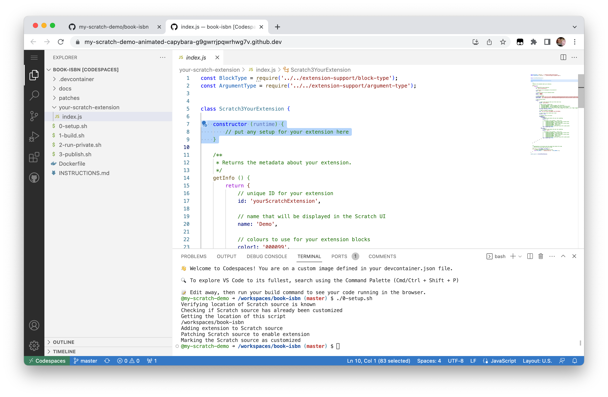

# Develop your own Scratch extension

1. [Create an account on GitHub](#create-an-account-on-github)
2. [Create your Scratch repository](#create-your-scratch-development-repository)
3. [Go into Codespaces](#launch-codespaces)
4. [Setup repository](#setup-your-repository)
5. [Create your extension](#create-your-extension)
6. [Customize the Extension Menu](#customize-the-extensions-menu)
7. [Publish your Scratch extension](#publish-your-finished-extension)
8. [Stop your codespace](#stop-your-codespace)
9. [Save your code](#save-your-changes)

---

## Create an account on GitHub

_**If you already have a GitHub account, you can [skip to step 2](#create-your-scratch-development-repository).**_

Go to https://github.com


Click on **Sign up**


Create your account


Note that your GitHub **username** will be part of the web address for your modified Scratch fork, so you may want to keep that in mind when you choose your username.


When you get to the **Welcome** screen, you can fill in the personalization survey if you wish, but it is okay to click on the **Skip personalization** link at the bottom of the screen if you prefer.


You should now have a GitHub account, ready to create your Scratch repository.

---

## Create your Scratch development repository

Go to https://github.com/dalelane/scratch-extension-development

_If you aren't already logged into GitHub, you should log in now._


Click on **Use this template** and then choose **Create a new repository**


Give your new repository a name.

Note that the repository name will be part of the web address for your modified Scratch fork, so you may want to keep that in mind when you choose a name.


Your repository is ready for use.


---

## Launch codespaces

Click on **Code** -> **Codespaces** -> **Create codespace**


It can take a minute or two to set up your codespace.


Your codespace is ready for use.


---

## Setup your repository

In the terminal at the bottom of the window, run:
```sh
./0-setup.sh
```


This should be very quick.

You only need to do this once (but it is safe if you run it again).


---

## Create your extension

Open the `your-scratch-extension/index.js` file.


The instructions here will show you how to write an extension that can lookup the title of a book by it's ISBN number.

The instructions will go through the template JavaScript one section at a time.

No changes are needed in the `constructor` for this extension.



Edit the `getInfo()` function to provide a description of your blocks.

```js
getInfo () {
  return {
    // unique ID for your extension
    id: 'yourScratchExtension',

    // name displayed in the Scratch UI
    name: 'ISBN Lookup',

    // colours to use for your extension blocks
    color1: '#000099',
    color2: '#660066',

    // your Scratch blocks
    blocks: [
      {
        // function where your code logic lives
        opcode: 'myFirstBlock',

        // type of block
        blockType: BlockType.REPORTER,

        // label to display on the block
        text: 'Title for ISBN book [BOOK_NUMBER]',

        // true if this block should end a stack
        terminal: false,

        // arguments used in the block
        arguments: {
          BOOK_NUMBER: {
            defaultValue: 1718500564,

            // type/shape of the parameter
            type: ArgumentType.NUMBER
          }
        }
      }
    ]
  };
}
```


Edit the `myFirstBlock` function implementation to look up book info using the [OpenLibrary API](https://openlibrary.org/dev/docs/api/books).

```js
myFirstBlock ({ BOOK_NUMBER }) {
  return fetch('https://openlibrary.org/isbn/' + BOOK_NUMBER + '.json')
    .then((response) => {
      if (response.ok) {
        return response.json();
      }
      else {
        return { title: 'Unknown' };
      }
    })
    .then((bookinfo) => {
      return bookinfo.title;
    });
}
```


Your code is now ready to test.

---

## Launch a private test of your Scratch extension

In the terminal at the bottom of the window, run:
```sh
./1-build.sh
```


This can take a minute to run.


In the terminal at the bottom of the window, run:
```sh
./2-run-private.sh
```


A pop-up should appear in the bottom-right with a button to open a private window with your modified version of Scratch.


If it doesn't appear, or you accidentally dismiss it, you can get the link from the **Open in browser** button on the **Ports** tab.


Either way, click on **Open in browser**.


This is a private copy of Scratch that only you can access. You can use this to test your new extension.


If you need to make a change, stop your Scratch test by pressing **Control-C** in the terminal.

Make your code changes.

Then re-build and test again by typing:
```sh
./1-build.sh
./2-run-private.sh
```

Once you have finished, stop your Scratch test by pressing **Control-C** in the terminal.


---

## Customize the Extensions menu

Your extension is represented in the Scratch Extensions menu using the graphics `your-extension-background.png` and `your-extension-icon.png`.

Edit these files to better represent your Scratch extension.

(I recommend keeping the dimensions of the images the same as they currently are to best fit in the menu).

---

## Publish your finished extension

In the terminal at the bottom of the window, run:
```sh
./3-publish.sh
```


This can take a minute to run.


Your Scratch fork will be live and publicly accessible at:

```
https://<YOUR-GITHUB-USERNAME>.github.io/<YOUR-REPOSITORY-NAME>/scratch
```


_Note that this can sometimes take a minute to go live, so if the link doesn't work, it's worth waiting a moment and trying again. If it still doesn't work, check you have got the URL correct._

You can give this URL to your students.


---

## Stop your codespace

You only need your codespace running while you are developing your extension. Once it's published, you must stop your codespace.

On your repository page, click on **Code** -> **Codespaces** -> **Stop codespace**.


---

## Further development

If you want to make additional changes, you can start your codespace again and continue from where you left off.
